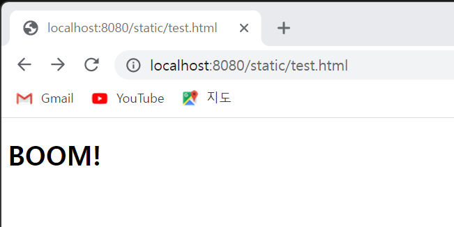

# axum_static
  [](https://github.com/myyrakle/axum_static/blob/master/LICENSE) 

static file serving router for axum server

## requirements

1. axum 0.6.*

## guide

Usage is very simple.

First install crate.
```
cargo add axum_static
```

Then, a static router is created and nested in the existing router as follows.
```
let app = Router::new()
        .route("/", get(index))
        ......
        .nest("/static", axum_static::static_router("static"))
```

The argument of the `static_router` function is the path to read static files based on the project root path.

Then you can read the file like this.
It can also be a sub directory.



This is the end.

How easy is it?